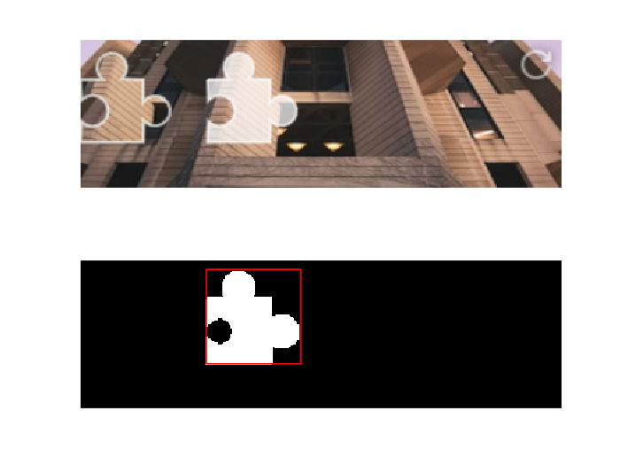
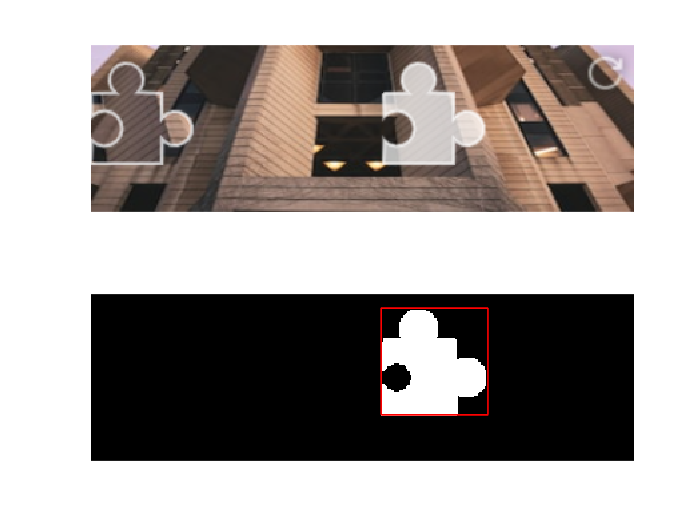
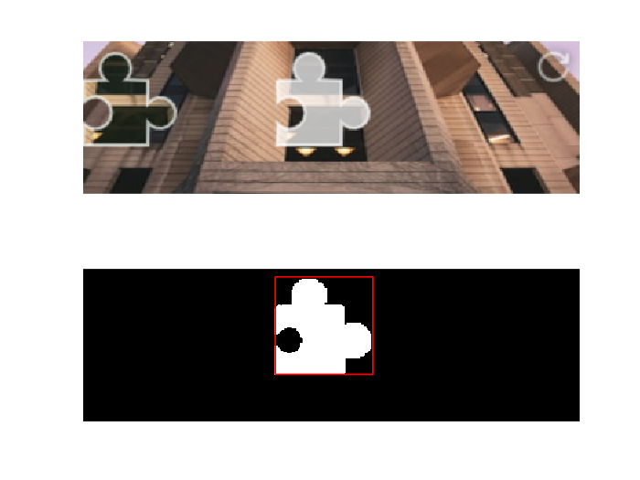

在已知背景图的情况下，识别一类滑动验证码的目标位置边界。

## 使用

背景图为 `background.bmp`，用于识别的图片为 `target.bmp`。`target.bmp` 的长和宽必须分别不小于 `background.bmp` 的长和宽。

`target.bmp` 可以通过截图得到。若 `background.bmp` 的最左上角的 RGB 值不为 `#FFFFFF`，则 `target.bmp` 的外围可以有白边，否则 `target.bmp` 的尺寸必须与 `background.bmp` 相同。

## 样例

